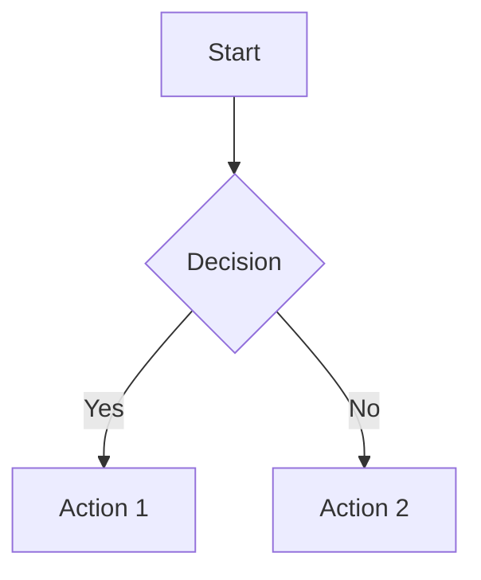
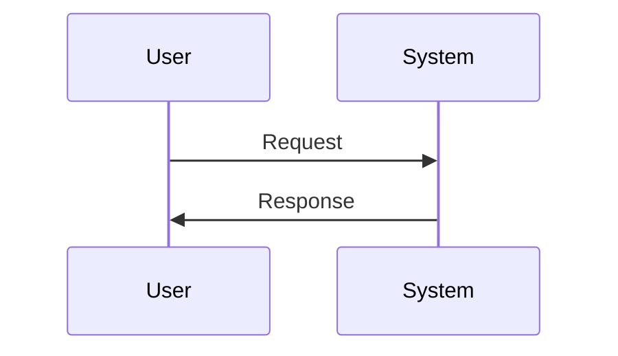
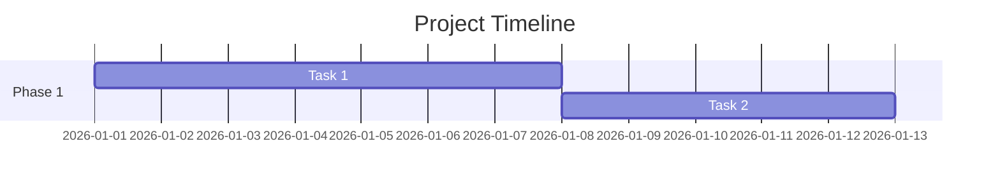
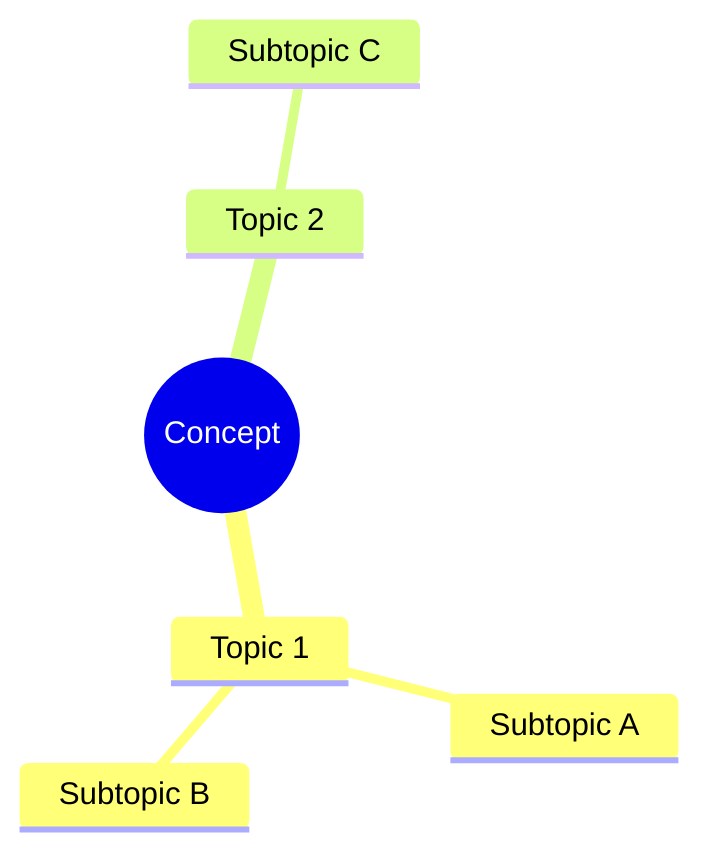

## What I do

Provide comprehensive formatting rules and guidelines for creating and editing notes in the SecondBrain Obsidian vault, which follows the PARA methodology (Projects, Areas, Resources, Archives).

## When to use me

Use this skill whenever you need to:
- Create a new note in the SecondBrain vault
- Edit an existing note in the SecondBrain vault
- Format markdown content for Obsidian
- Add frontmatter to SecondBrain notes
- Create WikiLinks in SecondBrain notes

## Language and Style

### British English (REQUIRED)
Always use British English spelling and phrasing:
- **organise** (not organize)
- **colour** (not color)
- **realise** (not realize)
- **behaviour** (not behavior)
- **analyse** (not analyze)
- **centre** (not center)
- **honour** (not honor)
- **favour** (not favor)

### Tone and Writing Style
- **Professional yet personal** - write as if documenting for your future self
- **Concise and informative** - every word should earn its place
- **Direct and actionable** - focus on insights and key takeaways
- **Scannable** - use clear structure, headings, and bullet points
- **Link liberally** - create connections between related concepts

## Frontmatter

**Important**: Frontmatter is YAML and does not support WikiLinks. Use plain strings for people and dates in frontmatter. Use WikiLinks only in the body content of your notes.

### General Notes
```yaml
---
tags: [tag1, tag2, tag3]
categories: Primary Category
Created: YYYY-MM-DD HH:mm
---
```

### Project Notes
```yaml
---
Class: Project
Status: Active
Start: YYYY-MM-DD
---
```

### Meeting Notes
```yaml
---
tags: [meeting, 1-1]
Date: YYYY-MM-DD
Attendees:
  - Person Name 1
  - Person Name 2
---
```

### Blog Posts
```yaml
---
title: "Post Title"
date: YYYY-MM-DD
description: "Brief description"
tags: [tag1, tag2]
draft: false
---
```

### Project Notes
```yaml
---
Class: Project
Status: Active
Start: YYYY-MM-DD
---
```

### Meeting Notes
```yaml
---
tags: [meeting, 1-1]
Date: YYYY-MM-DD
Attendees:
  - Person Name 1
  - Person Name 2
---
```

### Blog Posts
```yaml
---
title: "Post Title"
date: YYYY-MM-DD
description: "Brief description"
tags: [tag1, tag2]
draft: false
---
```

## WikiLinks

### People
Format: `[[Firstname Lastname]]`

Examples:
- `[[Stewart Bowie]]`
- `[[Callum Lowry]]`
- `[[Harry Wilkins]]`

### Dates
Format: `[[YYYY-MM-DD]]` (ISO 8601 format)

Examples:
- `[[2026-01-12]]`
- `[[2025-12-25]]`

**Important:** Use YYYY-MM-DD format, not DD-MM-YYYY

### Concepts and Topics
Format: `[[Concept Name]]`

Examples:
- `[[Conway's Law]]`
- `[[Team Cognitive Load]]`
- `[[PARA Method]]`

### Projects and Areas
Link to projects and areas with full path when ambiguous:

Examples:
- `[[1 - Projects/AI Adoption & DX Transformation]]`
- `[[2 - Areas/Work/Line Management]]`

### Aliased Links
When you want different display text:

Format: `[[Actual Note Name|Display Text]]`

Example: `[[1 - Projects/Platform Redesign|platform]]`

## Markdown Structure

### Headings
- Use `##` for main sections (H2)
- Use `###` for subsections (H3)
- Use `####` sparingly for sub-subsections (H4)
- **Never use `#` (H1)** - the note title serves as H1

### Lists
**Bullet points** for:
- Action items
- Key takeaways
- Features or characteristics
- Related concepts

**Numbered lists** for:
- Step-by-step processes
- Ordered priorities
- Sequential information

### Emphasis
- **Bold** (`**text**`) for key terms and important emphasis
- *Italics* (`*text*`) for subtle emphasis or terms being defined
- `Code formatting` for technical terms, commands, file names

### Blockquotes
Use `>` for:
- Important callouts
- Quotes from sources
- Key insights to highlight

## Obsidian Callouts

Use Obsidian's special callout syntax for structured emphasis:

### Information Box
```markdown
>[!info]
>Informational content here
```

### Important Points
```markdown
>[!important]
>Critical information that must not be missed
```

### Quotes
```markdown
>[!quote]
>Author Name
>Quote text here
```

### Project Goals
```markdown
>[!Goal]
>Project goal or objective
```

### Warnings
```markdown
>[!warning]
>Warning or caution information
```

### Tips
```markdown
>[!tip]
>Helpful tip or suggestion
```

## Mermaid Diagrams

Use Obsidian's mermaid diagram features to add clarity and help with understanding complex concepts.

### Flowcharts


### Sequence Diagrams


### Gantt Charts (for project timelines)


### Mind Maps


## Source Attribution

### Links Section
Always include a `## Links` section when referencing external material:

```markdown
## Links
- [Article Title](https://example.com/article)
- [Book on Amazon](https://amazon.co.uk/book)
- [Documentation](https://docs.example.com)
```

### Book References
```markdown
>[!info]
>**Synopsis:** Brief description of the book
>**Author:** Author Name
>**Published:** YYYY

## Links
[Book Title on Amazon](https://amazon.co.uk/...)
```

### Related Notes
Link to related notes in your vault:
```markdown
## Related Notes
- [[Related Concept 1]]
- [[Related Project]]
- [[Related Person]]
```

## PARA Folder Structure

The SecondBrain vault is organised using the PARA method:

### Location Mapping
- **`0 - Journal/`** - Daily, weekly, and monthly notes (highly automated)
- **`1 - Projects/`** - Active projects with defined goals and end dates
- **`2 - Areas/`** - Broad areas of responsibility or interest (ongoing)
- **`3 - Me/`** - Personal information, reflections, and self-notes
- **`4 - Goals/`** - High-level personal and professional goals
- **`5 - People/`** - Notes about individuals (Work/ and Personal/ subdirs)
- **`6 - Recipes/`** - Cooking recipes
- **`9 - Blog/`** - Blog drafts and ideas
- **`A - Avayler/`** - Work-related notes for "Avayler" company
- **`B - Sources/`** - Notes from books, articles, podcasts, etc.
- **`C - Resources/`** - Topic-based resource notes and reference material
- **`D - Meeting Notes/`** - Captured from meetings (1:1s, team meetings, etc.)
- **`E - Tasks/`** - Task-related views (often linked from `Tasklist.md`)
- **`F - Archives/`** - Completed or inactive items from other folders
- **`Z - Meta/`** - Templates, scripts, and vault-supporting files (do not modify unless asked)

### Note Placement Guidelines
- **Projects:** Active work with a defined end goal → `1 - Projects/`
- **Areas:** Ongoing responsibilities (e.g., "Line Management") → `2 - Areas/`
- **Resources:** Reference material on a topic → `C - Resources/`
- **People:** Notes about individuals → `5 - People/Work/` or `5 - People/Personal/`
- **Meetings:** Meeting notes → `D - Meeting Notes/`
- **New unsorted notes:** → `+/` (inbox folder for processing)

## File Naming

### Use Spaces, Not Underscores
❌ `my_note_title.md`
✅ `My Note Title.md`

### Clear, Descriptive Names
❌ `stuff.md`
✅ `Platform Architecture Decisions.md`

### Date-Specific Notes
- **Daily notes:** `YYYY-MM-DD.md` (e.g., `2026-01-12.md`)
- **Weekly notes:** `gggg-[W]ww.md` (e.g., `2025-W42.md`)
- **Monthly notes:** `YYYY-MM.md` (e.g., `2026-01.md`)

## Templates

Templates are located in `Z - Meta/Templates/`:
- **`Note.md`** - Base template for general-purpose notes
- **`Daily.md`** - Template for daily notes (with navigation, tasks, journaling)
- **`Project.md`** - Template for new projects

**Important:** When creating a new note of a specific type, check the corresponding template in `Z - Meta/Templates/` to understand the expected structure.

## Vault Location

The SecondBrain vault is located at:
```
/home/mark/AI/SecondBrain/
```

## Examples

### Good Concise Structure
```markdown
## Key Takeaways
- Teams are more effective than individuals for software delivery
- Limit team size based on Dunbar's number
- Restrict responsibilities to match team cognitive load
```

### Good Linking
```markdown
[[Conway's Law]] suggests major gains from designing software architectures 
and team interactions together. This relates to [[Team Cognitive Load]] and 
affects how we structure our [[1 - Projects/Platform Redesign|platform]].
```

### Good Source Attribution
```markdown
>[!info]
>**Synopsis:** A Proven Method to Organise your Digital Life
>**Author:** Tiago Forte
>**Published:** 2022

## Summary
The PARA method organises information into four categories...

## Links
- [Building a Second Brain](https://www.buildingasecondbrain.com/)
- [Book on Amazon](https://www.amazon.co.uk/Building-Second-Brain-Organise-Potential/dp/1800812213)
```

### Good Meeting Note
```markdown
---
tags: [meeting, 1-1]
Date: 2026-01-12
Attendees:
  - Mark Lambert
  - Stewart Bowie
---

## Agenda
- Project progress review
- Workload and capacity
- Career development goals

## Discussion

### Project Progress
[[Stewart Bowie]] has completed the integration work ahead of schedule. Next steps are...

### Action Items
- [ ] **Mark:** Schedule architecture review meeting
- [ ] **Stewart:** Document API endpoints by [[2026-01-20]]

## Follow-up
Next 1:1 scheduled for [[2026-02-09]]
```

## Common Mistakes to Avoid

❌ Using American English (organize, color, realize)
❌ Using underscores in file names (my_note.md)
❌ Using DD-MM-YYYY date format instead of YYYY-MM-DD
❌ Missing frontmatter entirely
❌ **Using WikiLinks in frontmatter** (e.g., `Attendees: [[Name]]`) - use plain strings instead
❌ Not linking to related people, dates, or concepts in body content
❌ Using H1 (`#`) for section headings
❌ Verbose or fluffy writing without substance
❌ Missing source attribution for external references
❌ Not using callouts for important information
❌ Creating notes without considering PARA placement

## Summary

When working with SecondBrain notes:
1. **Always use British English** throughout
2. **Add proper frontmatter** for the note type
3. **Link liberally** using WikiLinks (`[[Name]]`)
4. **Use clear structure** with headings and lists
5. **Be concise and actionable** - respect the reader's time
6. **Place notes in the correct PARA folder**
7. **Use mermaid diagrams** for complex concepts
8. **Attribute sources** properly in a Links section
9. **Use callouts** for important information
10. **Follow naming conventions** (spaces, not underscores)
